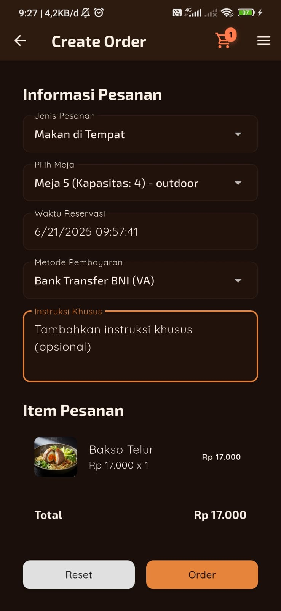
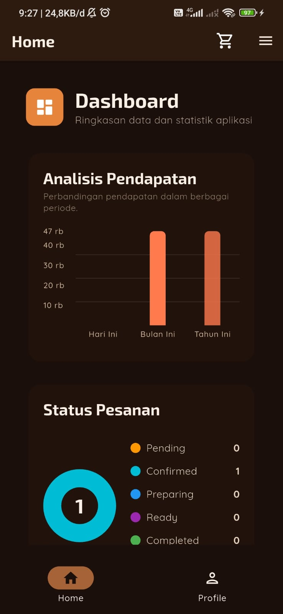
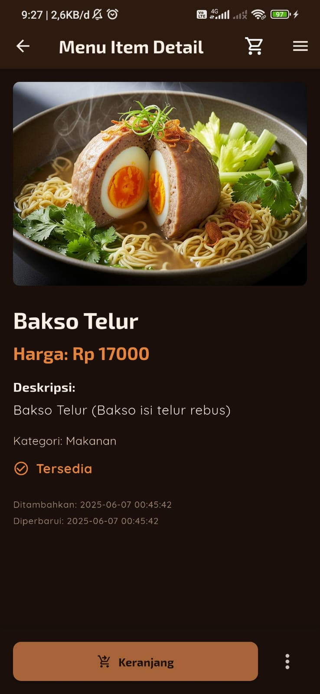
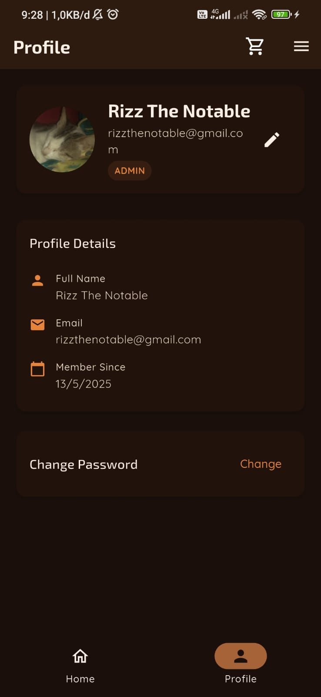
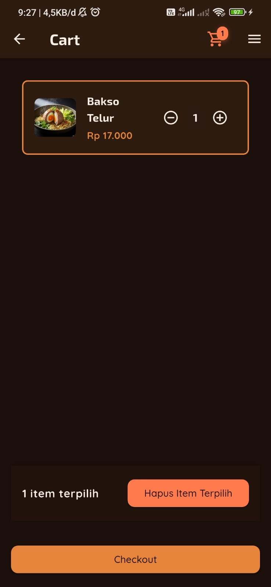
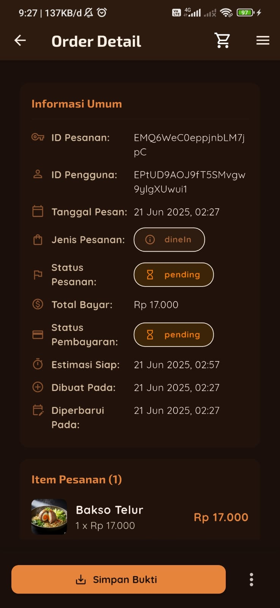
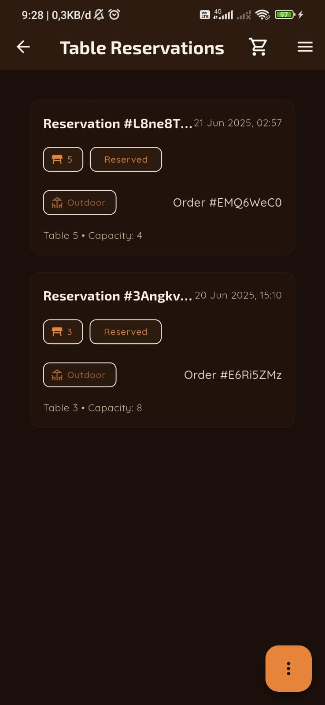

# Aplikasi POS Order Bakso Pentol

Aplikasi Point of Sale (POS) berbasis mobile yang dibuat untuk memudahkan proses pemesanan dan manajemen di warung Bakso Pentol. Aplikasi ini dikembangkan sebagai solusi digital untuk admin/kasir, dengan fokus pada pengelolaan produk, pesanan, dan transaksi secara efisien.

---

## Daftar Isi
- [Aplikasi POS Order Bakso Pentol](#aplikasi-pos-order-bakso-pentol)
  - [Daftar Isi](#daftar-isi)
  - [Fitur Utama](#fitur-utama)
  - [Teknologi \& Arsitektur](#teknologi--arsitektur)
    - [Arsitektur](#arsitektur)
  - [Tangkapan Layar (Screenshot)](#tangkapan-layar-screenshot)
  - [Prasyarat \& Instalasi](#prasyarat--instalasi)
  - [Struktur Proyek](#struktur-proyek)

---

## Fitur Utama

* **Autentikasi Admin**: Proses registrasi dan login yang aman untuk admin.
* **Manajemen Produk**: Admin dapat melakukan operasi CRUD (Create, Read, Update, Delete) untuk data produk bakso.
* **Manajemen Kategori**: Admin dapat mengelola kategori produk untuk pengelompokan menu yang lebih baik.
* **Proses Pemesanan (Order)**: Antarmuka untuk membuat pesanan baru, memilih produk, menentukan jumlah, dan menghitung total transaksi.
* **Manajemen Pesanan**: Admin dapat melihat dan memperbarui status setiap pesanan yang masuk (misalnya: diproses, selesai).
* **Riwayat Pesanan**: Fitur untuk melihat daftar transaksi yang telah selesai, yang berguna untuk rekapitulasi dan pelaporan.
* **Logout**: Mengamankan sesi admin dengan keluar dari sistem.

---

## Teknologi & Arsitektur

Proyek ini dibangun menggunakan Flutter dengan *backend-as-a-service* dari Firebase.

* **Framework**: Flutter
* **Bahasa**: Dart
* **Backend & Database**: Firebase (Authentication, Firestore, Storage, Cloud Messaging)
* **State Management**: `flutter_riverpod`
* **Routing**: `auto_route`
* **Networking**: `dio`
* **Service Locator**: `get_it`
* **Local Storage**: `flutter_secure_storage` & `shared_preferences`

### Arsitektur

Proyek ini mengadopsi arsitektur *feature-driven* yang memisahkan setiap fungsionalitas ke dalam modulnya masing-masing. Struktur ini dirancang untuk skalabilitas dan kemudahan pemeliharaan.

* `📁 lib/core`: Berisi komponen inti aplikasi seperti konfigurasi *routing* (`auto_route`), tema, konstanta, dan *utility classes* yang bersifat umum.
* `📁 lib/data`: Lapisan data yang bertanggung jawab atas sumber data. Berisi *models* (representasi objek data), *repositories* (abstraksi untuk pengambilan data dari Firebase), dan *seeders* (untuk data awal).
* `📁 lib/features`: Direktori utama tempat setiap fitur aplikasi berada (misalnya `auth`, `order`, `menu_item`). Setiap folder fitur berisi *logic* (providers/state), *UI* (screens/widgets), dan komponen spesifik lainnya.
* `📁 lib/shared`: Berisi *widgets*, *services*, dan *models* yang digunakan oleh lebih dari satu fitur untuk menghindari duplikasi kode.

---

## Tangkapan Layar (Screenshot)










-----

## Prasyarat & Instalasi

Pastikan Flutter SDK versi 3.x.x atau yang lebih baru sudah terpasang di mesin Anda.

1.  **Clone Repositori**

    ```bash
    git clone -b gacor_parah [https://github.com/ariebhewhe/globalSabtuGenap2425/](https://github.com/ariebhewhe/globalSabtuGenap2425/)
    cd globalSabtuGenap2425
    ```

2.  **Konfigurasi Firebase**
    Proyek ini memerlukan koneksi ke proyek Firebase.

      * Buat proyek baru di [Firebase Console](https://console.firebase.google.com/).
      * Tambahkan aplikasi Android dan/atau iOS ke proyek Firebase Anda.
      * Unduh file konfigurasi `google-services.json` (untuk Android) dan letakkan di direktori `android/app/`.
      * Unduh file `GoogleService-Info.plist` (untuk iOS) dan konfigurasikan di Xcode.
      * Aktifkan layanan **Authentication**, **Firestore Database**, dan **Storage**.

3.  **Instal Dependencies**
    Jalankan perintah berikut dari direktori root proyek:

    ```bash
    flutter pub get
    ```

4.  **Jalankan Aplikasi**

    ```bash
    flutter run
    ```

-----

## Struktur Proyek

Struktur direktori `lib` yang digunakan dalam proyek ini adalah sebagai berikut:

```
└── 📁lib
    ├── 📁core
    │   ├── 📁abstractions
    │   ├── 📁constants
    │   ├── 📁helpers
    │   ├── 📁routes
    │   ├── 📁theme
    │   └── 📁utils
    ├── 📁data
    │   ├── 📁models
    │   ├── 📁repositories
    │   └── 📁seeders
    ├── 📁features
    │   ├── 📁auth
    │   ├── 📁cart
    │   ├── 📁category
    │   ├── 📁home
    │   ├── 📁menu_item
    │   ├── 📁order
    │   ├── 📁payment_method
    │   ├── 📁profile
    │   ├── 📁restaurant_table
    │   └── 📁table_reservation
    │   └── 📁user
    ├── 📁shared
    │   ├── 📁models
    │   ├── 📁providers
    │   ├── 📁screens
    │   ├── 📁services
    │   └── 📁widgets
    ├── firebase_options.dart
    ├── main.dart
    └── providers.dart
```
