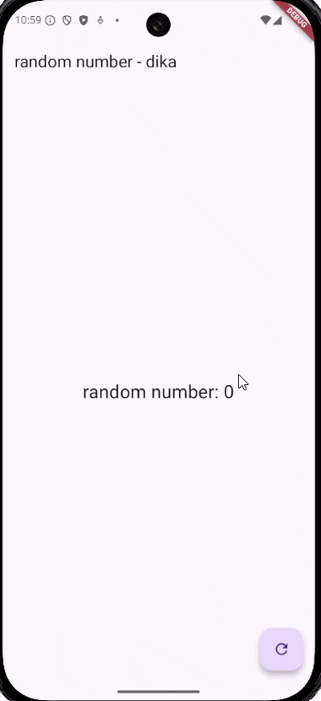

# bloc_random_dika

## Praktikum 7
### Soal 13
- file random_bloc.dart berisi logika, menerima event melalui _generateRandomController dan menghasilkan state angka acak melalui _randomNumberController, generateRandom untuk membuat angka acak, randomNumber adalah Stream<int> yang mengalirkan angka acak ke UI
- file random_screen.dart berisi uinya, seperti mendengarkan randomNumber untuk memperbarui teks angka acak di layar, lalu tombol FloatingActionButton mengirim event ke BLoC melalui generateRandom.add(null)
- lalu dispose() menutup semua StreamController untuk mencegah kebocoran memori
